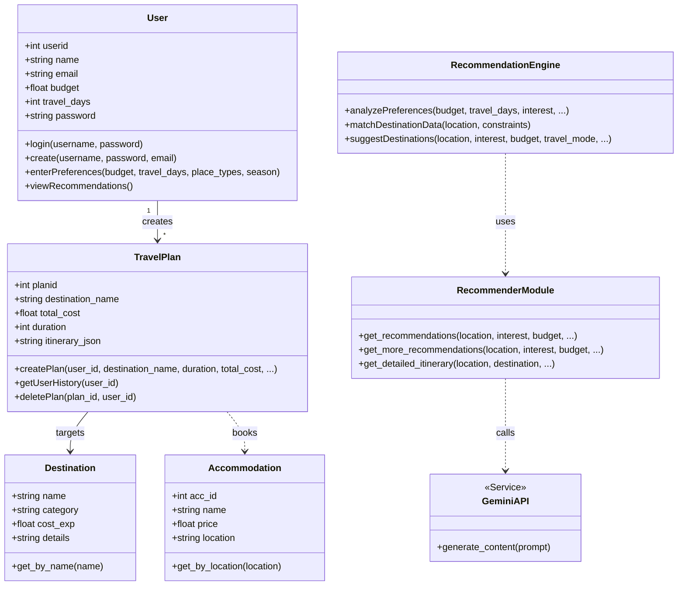
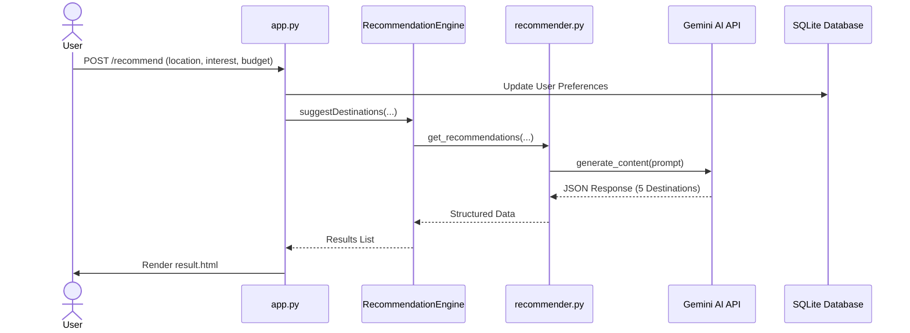
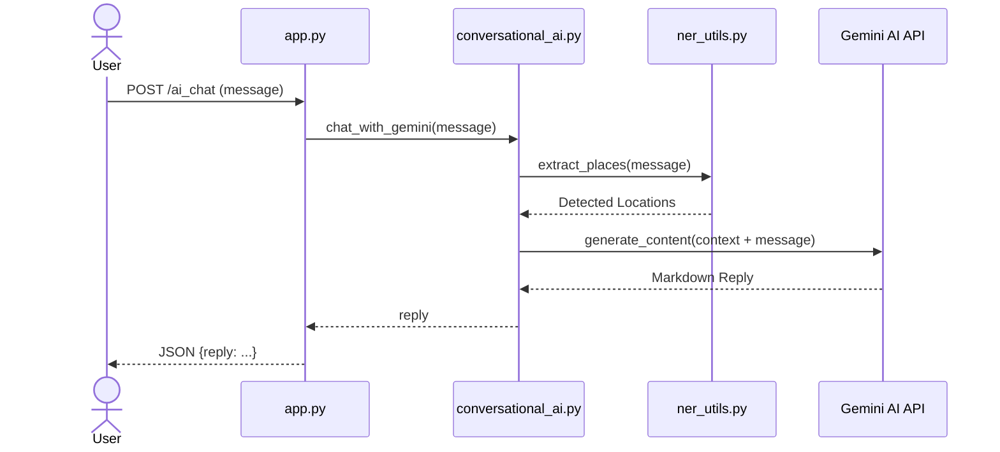
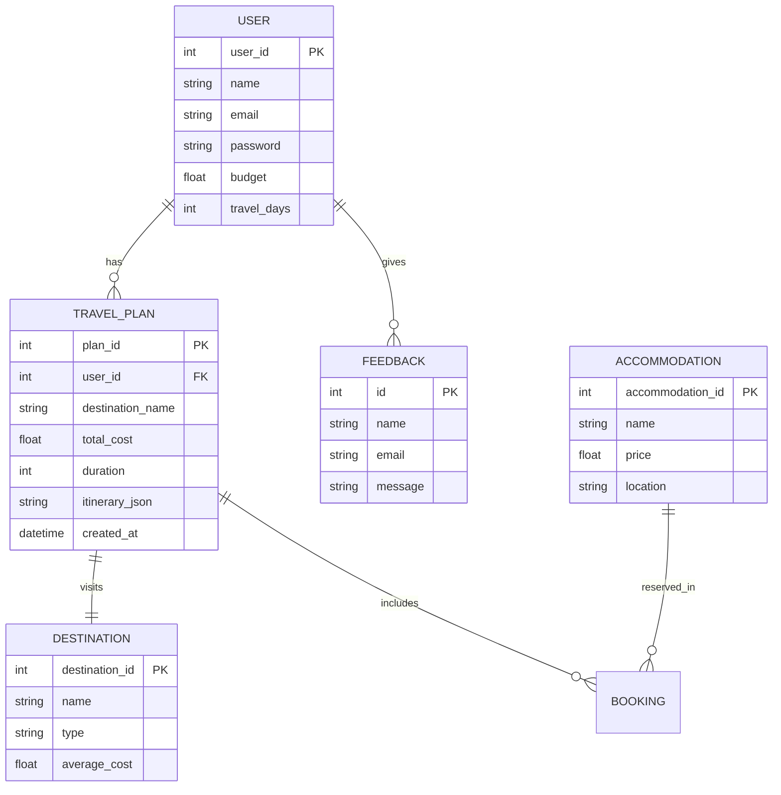

# TravelMate UML Diagrams

This document contains the UML diagrams for the TravelMate AI Travel Planner project, visualized using Mermaid.

## 1. Class Diagram
The following diagram represents the core data structures and logic components of the application.

## 2. Sequence Diagram: Recommendation Flow
This diagram shows the process of a user requesting travel recommendations.

## 3. Sequence Diagram: Chatbot Interaction
This diagram shows how the AI Chatbot handles user queries.

## 4. Database Schema (ER Diagram)
Visual representation of the database tables and their relationships.

